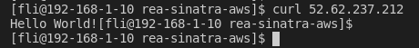
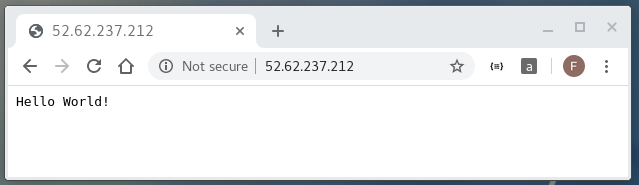

# Solution

This solution will deploy [REA Systems Engineer practical task](https://github.com/rea-cruitment/simple-sinatra-app) to an AWS EC2 instance.

## Before start

* Prepare a linux host (physical or virtual) with [aws cli](https://docs.aws.amazon.com/cli/latest/userguide//install-cliv2-linux.html) installed

* Prepare an aws account and an user with enough provileges

> Note: I created a new user `readmin` for this project and configure it as default profile. 

```
[fli@192-168-1-10 ~]$ aws2 configure list-profiles | grep default
default
[fli@192-168-1-10 ~]$  
```

## Step 1: clone this repo `git clone git@github.com:fen9li/rea-sinatra-aws.git` and change directory to it
```
git clone git@github.com:fen9li/rea-sinatra-aws.git
cd rea-sinatra-aws
```

## Step 2: spin up the `rea-sinatra` stack
> Note: please use `simple-sinatra-app-stack-prod.yaml` at this stage. No SSH login to EC2 instance in production.

```
aws2 cloudformation create-stack --stack-name rea-sinatra --template-body file://simple-sinatra-app-stack-prod.yaml
```

## Step 3: wait till the stack is fully up and running, then get the stack output -- it is an ip address
```
[fli@192-168-1-10 rea-sinatra-aws]$ aws2 cloudformation describe-stacks --stack-name rea-sinatra --query 'Stacks[].Outputs[].OutputValue'
[
    "52.62.237.212"
]
[fli@192-168-1-10 rea-sinatra-aws]$ 
```

## Step 4: test it 

* by using curl command

```
[fli@192-168-1-10 rea-sinatra-aws]$ curl 52.62.237.212
Hello World![fli@192-168-1-10 rea-sinatra-aws]$ 
```

> The screenshot    


* by using browser

> The screenshot    


## Step 5: clean up

```
aws2 cloudformation delete-stack --stack-name rea-sinatra
```

## Q & A